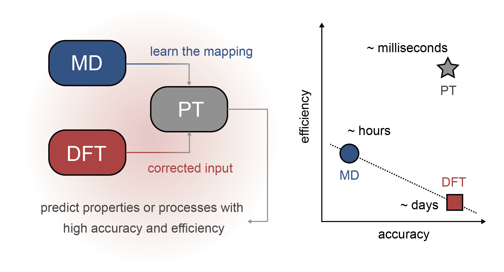

# Physics-Transfer Learning for Material Strength Screening

## Overview

The strength of materials, like many problems in the natural sciences, spans multiple length and time scales, and the solution has to balance accuracy and performance.
Material screening by strength from first-principles calculations is computationally intractable for the nonlocal nature of strength, and not included in the state-of-the-art computational material databases.
To address this challenge, we propose a physics-transfer (PT) framework to learn the physics from empirical atomistic simulations and then predict the strength from chemically accurate density functional theory-based calculations of material parameters.
Notably, the strengths of single-crystalline metals can be predicted from a few single-point calculations for the deformed lattice and on the γ surface, allowing efficient, high-throughput screening for material discovery.
This physics-transfer framework can be generalized to other problems facing the accuracy-performance dilemma, by harnessing the hierarchy of physics in the multiscale models of materials science.

## Installation

First, download the repository from GitHub.
```
git clone https://github.com/zhaoyj21/PT.git
cd ./PT
```

The codes for PT learning were coded in `python 3.9`.
The 'PT.yml' file is provided to creates an environment with the required packages.
```
conda env create -f ./PT.yml
```

## Building digital libraries

To construct the digital libraries, a wide spectrum of metals with crystalline structures of fcc (Cu, Ni, Al, Au, Pd, Pt), bcc (Fe, Mo, Ta, W), and hcp (Ti, Mg, Zr, Co) is explored.
The elastic constants, $\gamma$ surfaces, and Peierls stresses are calculated using empirical force fields such as EAM and MEAM with parameters reported from [different sources](https://www.ctcms.nist.gov/potentials/) [1].

To calculate the $\gamma$ surfaces, you can run the code on a HPC (high performance computing) cluster with SLURM (Simple Linux Utility for Resource Management).
```
cd ./PT/MD/gsf
sbatch sub.sh
```
To calculate the Peierls stresses, you can run the following code.
```
cd ./PT/MD/shear
sbatch sub.sh
```
Note: 
- The potential file 'cu.eam' can be replaced for other potential parameters and metals from [different sources](https://www.ctcms.nist.gov/potentials/).
- The file 'in.lmp' is the input scripts of LAMMPS (Large-scale Atomic/Molecular Massively Parallel Simulator) to calculate the $\gamma$ surfaces. For metals with different lattice structures, lattice contants, mass, you should modify this template file.
- The file 'sub.sh' is the script file that submits a task in the SLURM scheduling system, which specifies the number of computing resources the task occupies.

To extract the $\gamma$ surfaces, and Peierls stresses from the MD (molecular dynamics) results, you can find the MATLAB code in the following directory.
```
cd ./PT/Processing
```
Note: 
- The MATLAB script 'process_gamma_surface.m' is used to extract $\gamma$ surfaces.
- The MATLAB script 'detect_dislocation_move.m' is used to identify the movements of dislocations and extract Peierls stresses.
- For metals with differeet lattice structures, lattice contants, you should modify these template files.

Finally, the digital libraries of MD results are saved as the file ```MD_libraries.mat```.
